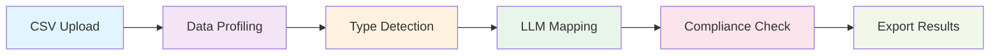
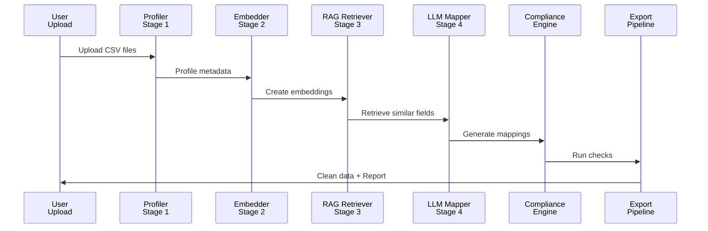

# cerclo hr replica agent

cerclo turns messy hr exports into mapped, checked, and exportable data. it profiles csv files, suggests canonical column mappings, runs compliance checks, and writes reports and review queues for the next step.

## structure

```text
app.py                        streamlit app
demo.py                       main demo entry point
demo_cli.py                   command-line demo
demo_agent.py                 agent demo entry point
demo_graphrag_compliance.py   graph rag compliance demo
src/
  ingestion.py                csv profiling and loading
  mapper.py                   column mapping logic and llm prompts
  agentic.py                  agent loop and orchestration
  pipeline.py                 end-to-end pipeline
  schema.py                   canonical data model
  compliance/
    rules.py                  compliance rules
    checker.py                rule execution and violations
    integration.py            data-to-compliance bridge
  rag/
    embedder.py               embedding helpers
    retriever.py              similarity retrieval
    vector_store.py           faiss-backed storage
datasets/                     sample hr data and labels
outputs/                      generated reports and agent runs
tests/                        test suite
```

## what it does

- reads employee, payroll, and leave csv files
- profiles each file so the mapper can understand the columns
- uses llms and rag to map messy names to canonical fields
- evaluates mappings against labels when they are available
- runs compliance checks for the mapped records
- exports csv, json, and markdown artifacts for review

## how to run

```bash
pip install -r requirements.txt
streamlit run app.py
```

to run the agent demo:

```bash
python demo_agent.py
```

## agent mode

the agent mode uses a simple loop:

1. discover the files and profile the data
2. build context for mapping
3. generate column mappings
4. evaluate the mappings
5. run compliance checks
6. export the artifacts

## System Architecture

### **Complete Data Processing Pipeline**



### **6-Stage Processing Flow**



### **What Each Stage Does**

| Stage | Component | Input | Output | Purpose |
|-------|-----------|-------|--------|---------|
| 1 | **Data Profiling** | Raw CSV files | Column metadata, types, nulls | Understand data shape and quality |
| 2️ | **Vector Embedding** | Canonical schema + field descriptions | FAISS vector index | Enable semantic search |
| 3️ | **RAG Retrieval** | Source column names | Similar canonical fields (top-k) | Find contextually relevant matches |
| 4️ | **LLM Mapping** | Source + retrieved canonical fields | Mapping with confidence score & reasoning | Intelligent column name transformation |
| 5️ | **Compliance Checking** | Mapped employee/payroll/leave data | List of violations by severity | Validate against 7 labor law rules |
| 6️ | **Data Export** | Cleaned data + violations | CSV/JSON with compliance report | Deliver actionable insights |

---

## outputs

- outputs/agent_<timestamp>/agent_run.json
- outputs/agent_<timestamp>/agent_summary.md
- outputs/agent_<timestamp>/column_mappings.csv
- outputs/agent_<timestamp>/review_queue.csv
- outputs/agent_<timestamp>/compliance_report.json

## notes

- the local ollama path is preferred for fast offline mapping
- the agent falls back to other modes when a backend is unavailable
- generated outputs and cache files are not meant to be committed

## tests

```bash
pytest
```

## license

no license file is included in this workspace.
