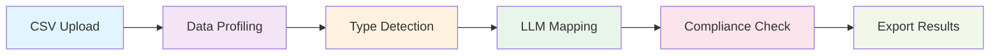
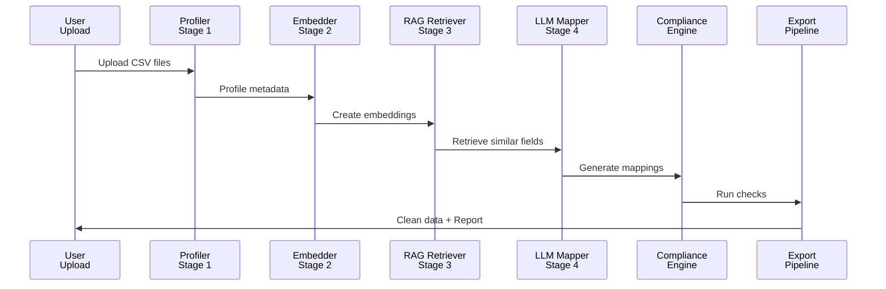

# cerclo hr replica agent

## about

cerclo is an agentic hr data migration platform for companies moving from messy legacy sheets to clean, compliant hr data.

it takes raw employee, payroll, and leave exports, maps columns to a canonical schema with llm + rag, runs compliance checks, and returns clean outputs plus a review queue.

the result is less manual cleanup, fewer risky errors, and faster migration go-live.

## why this matters

hr migration is still slow, manual, and error-prone in many teams.

one bad mapping can break payroll, leave balances, visa tracking, or compliance reporting.

cerclo turns that into a repeatable workflow that can be reviewed and improved over time.

## what makes this different

- agentic loop: discover, map, evaluate, check, export
- rag-first mapping: retrieves relevant fields before llm decisions
- compliance built in: checks mapped records before final export
- review-ready output: low-confidence mappings are separated for human review

## keywords

hr data migration, agentic workflow, llm mapping, rag retrieval, schema mapping, payroll migration, leave migration, compliance checks, uae labor rules, ksa labor rules, faiss vector search, review queue, streamlit

## inspiration

this project was inspired after i lost an interview with a yc backed company doing similar work that later raised a 12m series a.

that loss became fuel to build a practical, open version of the idea in my own way.

## structure

```text
app.py                        streamlit app
demo.py                       main demo entry point
demo_cli.py                   command-line demo
demo_agent.py                 agent demo entry point
demo_graphrag_compliance.py   graph rag compliance demo
src/
  ingestion.py                csv profiling and loading
  mapper.py                   column mapping logic and llm prompts
  agentic.py                  agent loop and orchestration
  pipeline.py                 end-to-end pipeline
  schema.py                   canonical data model
  compliance/
    rules.py                  compliance rules
    checker.py                rule execution and violations
    integration.py            data-to-compliance bridge
  rag/
    embedder.py               embedding helpers
    retriever.py              similarity retrieval
    vector_store.py           faiss-backed storage
datasets/                     sample hr data and labels
outputs/                      generated reports and agent runs
tests/                        test suite
```

## what it does

- reads employee, payroll, and leave csv files
- profiles each file so the mapper can understand the columns
- uses llms and rag to map messy names to canonical fields
- evaluates mappings against labels when they are available
- runs compliance checks for the mapped records
- exports csv, json, and markdown artifacts for review

## what i learned

i started by looking at messy hr csv files and asking what each column really means. the profiler helps me do that by showing names, types, nulls, and sample values. that part is important because you cannot map data well if you do not first understand the data.

next, i used llms and rag. rag means i do not send everything to the model at once. i first search for similar fields, then i give only the useful context to the model. this is better than stuffing the whole file into the prompt because it is simpler, faster, and usually gives cleaner answers.

then i used the compliance checker. this part turns rules into code, so the system can flag problems before they become bigger issues. that is useful because hr mistakes can affect pay, leave, visas, and legal compliance.

the agentic part is the control loop. it does not only run one fixed script. it discovers, plans, acts, checks results, and exports what it found. that is why it feels more like an agent than a plain pipeline.

## why this is better

this is better than a simple manual spreadsheet process because it is repeatable, faster, and easier to review. it is also better than sending random text to an llm because the rag step keeps the prompt focused on the right fields. the compliance layer also gives a second check, so the result is not just a guess.

## how to run

```bash
pip install -r requirements.txt
streamlit run app.py
```

to run the agent demo:

```bash
python demo_agent.py
```

## agent mode

the agent mode uses a simple loop:

1. discover the files and profile the data
2. build context for mapping
3. generate column mappings
4. evaluate the mappings
5. run compliance checks
6. export the artifacts

## System Architecture

### **Complete Data Processing Pipeline**



### **6-Stage Processing Flow**



### **What Each Stage Does**

| Stage | Component | Input | Output | Purpose |
|-------|-----------|-------|--------|---------|
| 1 | **Data Profiling** | Raw CSV files | Column metadata, types, nulls | Understand data shape and quality |
| 2️ | **Vector Embedding** | Canonical schema + field descriptions | FAISS vector index | Enable semantic search |
| 3️ | **RAG Retrieval** | Source column names | Similar canonical fields (top-k) | Find contextually relevant matches |
| 4️ | **LLM Mapping** | Source + retrieved canonical fields | Mapping with confidence score & reasoning | Intelligent column name transformation |
| 5️ | **Compliance Checking** | Mapped employee/payroll/leave data | List of violations by severity | Validate against 7 labor law rules |
| 6️ | **Data Export** | Cleaned data + violations | CSV/JSON with compliance report | Deliver actionable insights |

---

## outputs

- outputs/agent_<timestamp>/agent_run.json
- outputs/agent_<timestamp>/agent_summary.md
- outputs/agent_<timestamp>/column_mappings.csv
- outputs/agent_<timestamp>/review_queue.csv
- outputs/agent_<timestamp>/compliance_report.json

## notes

- the local ollama path is preferred for fast offline mapping
- the agent falls back to other modes when a backend is unavailable
- generated outputs and cache files are not meant to be committed

## how this can be improved

- add more labeled hr datasets so the mappings can learn from more examples
- add more country-specific labor rules and validation checks
- improve the prompt templates for edge cases and short abbreviations
- add better tests for the agent loop and export files
- add a small web review screen for approving low-confidence mappings

## pull requests

pull requests are welcome for fixes, better rules, better prompts, more examples, or clearer docs.

## tests

```bash
pytest
```

## license

no license file is included in this workspace.
